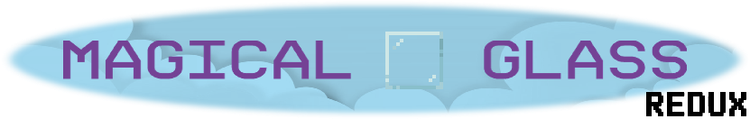

# Magical Glass for [Kristal](https://github.com/KristalTeam/Kristal)

Adds **UNDERTALE** battles (and more!) to Kristal!

## This library adds...
* UNDERTALE battles in the light and dark world!
* All of UNDERTALE's weapons and armors!
* Functionality for Spells and TP!
* A Froggit encounter!
* Expands the light world!
* Deltarune battles in the light world!
* ...And (hopefully) more!

## Credits:

### Lead:
* Sam Deluxe
* FireRainV

### Programmers:
* Sam Deluxe (like, everything)
* FireRainV (post support)
* Nyako (made the basics and dust code)
* bor (assistant, map recreations)
* Just Another Random User (assistant)
<!-- ## Contributors: -->
## Moldsmal Recreation:
* BrendaK2700

### Testers:
* Racckoon
* FireRainV

### Resources:
* UNDERTALE Team
* DELTATRAVELER Team
* AccurateJaney (Kris and Noelle Light World Sprites)
* Discarded_Vessel (Susie Light World Sprites)

### Emotional Support <3:
* Lots of people from the Kristal Discord and its subcommunities
* Eli
* Danny
* Juell
* Nathan
* Trihan
* Garon
* Rachel
* Cris
* skysakura
* NVI
* Welt
* Lynel
* Star Artsy
* Techno

### Programming Assistance:
* Kristal Team

### Sound Effects and Music:
* UNDERTALE Team
* deltarune Team
